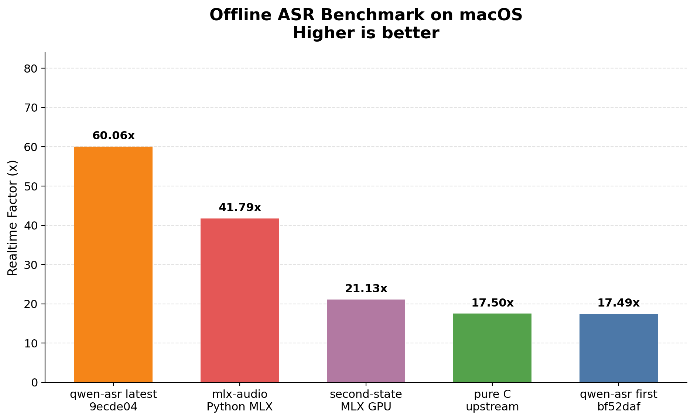

# Cross-Implementation Comparison

Apples-to-apples comparison of qwen-asr against the upstream pure C implementation and MLX-based baselines on the same audio and model.

## Methodology

- Offline benchmark on `bench/samples/audio.wav` (28.2 s, mono 16 kHz)
- Model: `qwen3-asr-0.6b`
- Implementations benchmarked sequentially, not in parallel
- Primary metric: median inference time across standalone rounds
- qwen-asr and pure C use internal inference timers; MLX-based implementations are timed after model load with explicit GPU synchronization
- Wall-clock time is retained as a secondary metric
- Default runs: 10

## Reproduce

```bash
./bench/benchmark-all.sh --runs 10
```

This script:
1. Builds qwen-asr first (`bf52daf`) and latest (current HEAD)
2. Clones/builds upstream C (`antirez/qwen-asr`)
3. Clones/builds `second-state/qwen3_asr_rs` (MLX backend)
4. Runs `mlx-audio` (MLX Python)
5. Normalizes results and renders `report.md` plus charts

Output: `bench/compare-results/<timestamp>/` with `report.md`, `summary.json`, charts, and raw logs.

> **Note:** the full comparison takes 30–60 minutes because it clones and builds three external implementations.

## Current qwen-asr HEAD

> Generated on: 2026-06-12
> Commit: `9ecde04`
> Runs: 10

| Mode | Median inference ms | Mean ms | Best ms | Realtime factor |
|---|---:|---:|---:|---:|
| offline | 447 | 460.7 | 444 | 63.09× |
| segmented | 336 | 337.0 | 333 | 83.93× |
| streaming | 345 | 344.5 | 342 | 81.74× |

See [`results.md`](./results.md) for the full speed-benchmark page.

## Latest Cross-Implementation Results

> Generated on: 2026-06-12 from `bench/compare-results/20260612T074144Z/`
> Runs per target: 10
> Hardware: Apple M5 Pro, 15 cores, 48 GB RAM, macOS 26.4
> Versions: upstream C `main`, second-state `v0.2.0` (`0226270`), mlx-audio `v0.4.4`
> Results are sorted by median inference latency (fastest first).

| Implementation | Commit / Version | Median inference ms | Mean ms | Best ms | RTF |
|---|---:|---:|---:|---:|---:|
| qwen-asr (latest) | `9ecde04` | 470 | 469 | 465 | 60.06× |
| mlx-audio Python MLX | `0.4.4` | 674 | 688 | 669 | 41.79× |
| second-state MLX GPU | `0226270` (v0.2.0) | 1,333 | 1,334 | 1,323 | 21.13× |
| pure C upstream | `b00b789` | 1,610 | 1,612 | 1,598 | 17.50× |
| qwen-asr (first) | `bf52daf` | 1,612 | 1,612 | 1,597 | 17.49× |

> **Note:** cross-implementation runs use `--threads 15` (system CPU count) for every implementation, so qwen-asr latest here is 470 ms versus 447 ms in the dedicated speed benchmark which uses performance cores by default.

### Wall-clock timing

| Implementation | Commit / Version | Median wall-clock ms | Mean ms | Best ms | Wall-clock RTF |
|---|---:|---:|---:|---:|---:|
| qwen-asr (latest) | `9ecde04` | 859 | 896 | 851 | 32.83× |
| second-state MLX GPU | `0226270` (v0.2.0) | 1,520 | 1,553 | 1,482 | 18.52× |
| mlx-audio Python MLX | `0.4.4` | 1,703 | 1,773 | 1,673 | 16.54× |
| pure C upstream | `b00b789` | 1,875 | 1,879 | 1,866 | 15.02× |
| qwen-asr (first) | `bf52daf` | 1,952 | 1,991 | 1,935 | 14.45× |




### Findings

- qwen-asr latest `9ecde04` is **3.43×** faster than the initial Rust port `bf52daf`.
- qwen-asr latest `9ecde04` is **3.43×** faster than the upstream pure C implementation.
- qwen-asr latest `9ecde04` is **2.84×** faster than second-state MLX GPU (v0.2.0) by inference latency.
- qwen-asr latest `9ecde04` is **1.44×** faster than mlx-audio Python MLX (v0.4.4) by inference latency.

## Why does pure CPU Rust beat GPU baselines?

1. **Hand-optimized NEON kernels** — custom `vDSP`/`Accelerate`, hand-written `neon_dotprod` matmul, and fused fast-attention tuned for the 0.6B model and Apple Silicon cache hierarchy.
2. **Zero framework overhead** — no tensor dispatch, memory pools, or FFI bridging; 100% Rust end-to-end.
3. **Model too small for GPU** — a 0.6B model cannot saturate the Metal GPU; kernel launch overhead and CPU↔GPU copies dominate.
4. **mlx-audio 8-bit overhead** — quantization saves memory but dequantization during compute adds extra work.

## Perf-round2 vs. previous implementation

A separate apples-to-apples comparison of the `perf-round2` optimization branch against the previous implementation (`main` @ `9e8205f`) is available in [`docs/research/experiments.md`](../research/experiments.md). Summary:

| Metric | Previous (`9e8205f`) | Latest (`perf-round2`) | Δ |
|---|---:|---:|---:|
| offline wall / infer | 1106 / 495 ms | 860 / 470 ms | −22.2% / −5.1% |
| segmented wall / infer | 987 / 378 ms | 740 / 356 ms | −25.0% / −5.8% |
| streaming wall / infer | 1003 / 390 ms | 753 / 365 ms | −24.9% / −6.4% |
| load floor (0.5 s clip) | 0.39 s | 0.17 s | −56% |
| 100-file LibriSpeech WER | 0.0387 | 0.0379 | better |

Accepted wins: parallel model-load conversions, batched-GEMM prefill causal attention, and default threads = performance cores.
