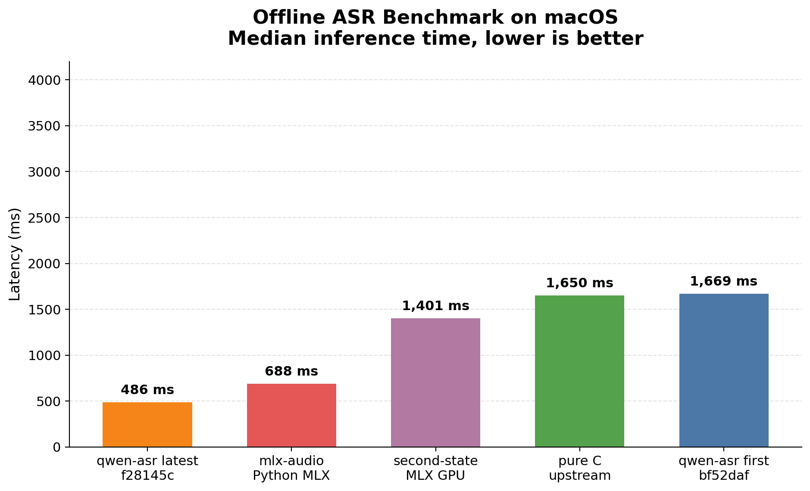
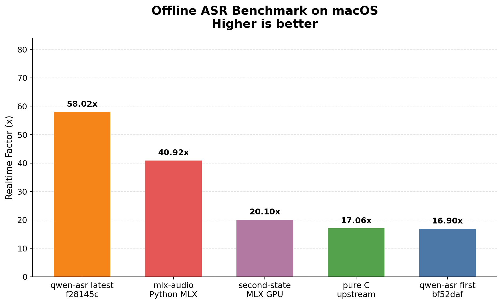

# Benchmark Report

## Methodology

- Offline benchmark on the same input WAV and model across five implementations.
- qwen-asr first: `bf52daf`.
- qwen-asr latest: `9ecde04`.
- Upstream C: `antirez/qwen-asr`.
- GPU baselines: `second-state/qwen3_asr_rs` MLX and `mlx-audio` Python MLX.
- Implementations are benchmarked sequentially, not in parallel; each round is a standalone process invocation.
- Primary metric is median inference time across standalone rounds for every implementation.
- qwen-asr and pure C use their internal inference timers. MLX-based implementations are timed after model load with explicit GPU synchronization.
- macOS Accelerate enabled for qwen-asr and pure C where applicable.
- Wall-clock time is retained as a secondary metric.
- Standalone rounds per target: `10`.
- Modes requested: `offline`.
- Results in the table and charts are sorted by median inference latency (fastest leftmost).

## Environment

- CPU: `Apple M5 Pro`
- Cores: `15 physical / 15 logical`
- Memory: `48.0 GB`
- Machine arch: `arm64`
- macOS: `26.4`
- Rustc: `rustc 1.90.0 (1159e78c4 2025-09-14)`
- Model dir: `/Users/lizhuo/owork/q-asr/qwen3-asr-0.6b`
- Input file: `/Users/lizhuo/owork/q-asr/bench/samples/audio.wav`

## Results

| Implementation | Commit | Median inference ms | Mean ms | Best ms | RTF |
|---|---:|---:|---:|---:|---:|
| qwen-asr (latest) | `9ecde04` | `470` | `469` | `465` | `60.06x` |
| mlx-audio Python MLX | `0.4.4` | `674` | `688` | `669` | `41.79x` |
| second-state MLX GPU | `0226270` | `1,333` | `1,334` | `1,323` | `21.13x` |
| pure C upstream | `b00b789` | `1,610` | `1,612` | `1,598` | `17.50x` |
| qwen-asr (first) | `bf52daf` | `1,612` | `1,612` | `1,597` | `17.49x` |

Wall-clock timing

| Implementation | Commit | Median wall-clock ms | Mean ms | Best ms | Wall-clock RTF |
|---|---:|---:|---:|---:|---:|
| qwen-asr (latest) | `9ecde04` | `859` | `896` | `851` | `32.83x` |
| mlx-audio Python MLX | `0.4.4` | `1,703` | `1,773` | `1,673` | `16.54x` |
| second-state MLX GPU | `0226270` | `1,520` | `1,553` | `1,482` | `18.52x` |
| pure C upstream | `b00b789` | `1,875` | `1,879` | `1,866` | `15.02x` |
| qwen-asr (first) | `bf52daf` | `1,952` | `1,991` | `1,935` | `14.45x` |

## Findings

- qwen-asr latest `9ecde04` is `3.43x` the speed of qwen-asr first `bf52daf`.
- qwen-asr latest `9ecde04` is `3.43x` faster than the upstream pure C implementation.
- qwen-asr latest `9ecde04` is `2.84x` faster than second-state MLX GPU by inference latency.
- qwen-asr latest `9ecde04` is `1.44x` faster than mlx-audio Python MLX by inference latency.

